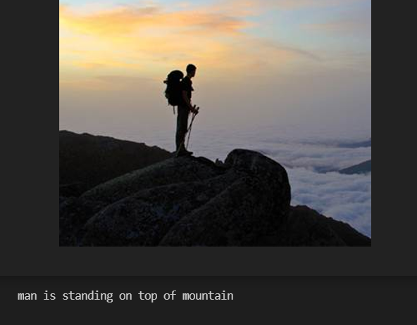
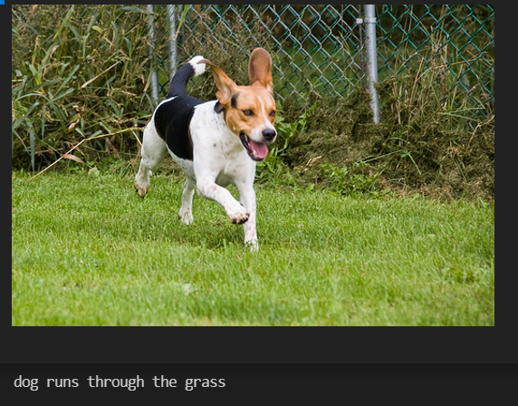

# Image-Caption-Generator

## Description 
  * This is the Project that gernerates Caption based on image.
  * This implementation is based on CNN-RNN using [Kaggle dataset](https://www.kaggle.com/adityajn105/flickr8k) and [Xception model](https://keras.io/api/applications/).  
## Dataset 
  * Download dataset for training.
  * Flickr8k_Dataset : https://github.com/jbrownlee/Datasets/releases/download/Flickr8k/Flickr8k_Dataset.zip
  * Flickr8k_text : https://github.com/jbrownlee/Datasets/releases/download/Flickr8k/Flickr8k_text.zip
## Download Trained Model
  - CNN-LSTM trained models - https://drive.google.com/drive/folders/1idyyc1KOdDGk9Wx6fYm75ulN73z_Tyv3?usp=sharing
  - feature.p file - https://drive.google.com/file/d/1ooiqBoIpfimXplCXr3DFkrAXjm5pSXaA/view?usp=sharing
  - tokenizer.p file - https://drive.google.com/file/d/1cSKDX59vnL4_MelnNPjtOKECGMXyn9Kx/view?usp=sharing
